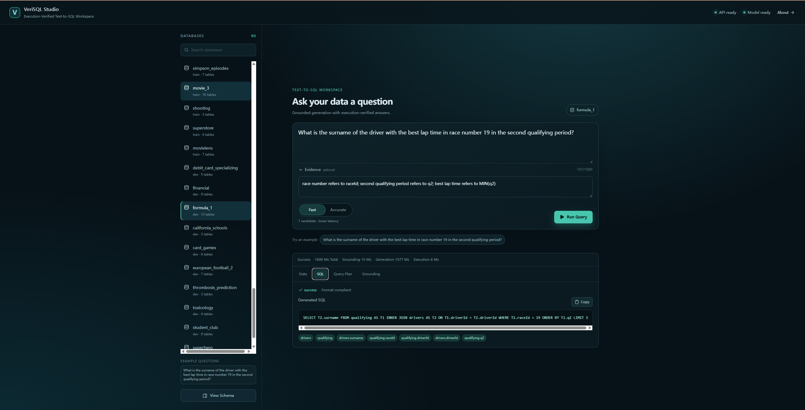
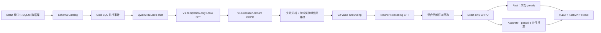

# VeriSQL-RL：面向 Text-to-SQL 的可执行反馈后训练系统

<p align="center">
  
  
  
  
  
  
  <a href="https://huggingface.co/collections/Capricornus1229/verisql-rl-adapter-family">
  
  </a>
</p>

VeriSQL-RL 是一套基于 **Qwen3-8B、BIRD-SQL 与 SQLite** 的完整大模型后训练与在线部署项目。系统从原始数据库和 Text-to-SQL 标注出发，打通数据准备、Schema 建模、Gold SQL 执行审计、completion-only LoRA SFT、在线执行奖励 GRPO、数据库值 Grounding、Teacher Reasoning、困难样本筛选、pass@8 执行投票，以及 vLLM + FastAPI + React 服务化部署。

项目保留两条可复现流水线：

- **V1 基线流水线**：在统一数据与评测口径下分离验证 Zero-shot、SFT 和 GRPO 的增益；
- **V2 最终流水线**：针对 V1 的奖励稀疏和数据库 Grounding 不足，引入值检索、Teacher Reasoning、混合困难样本筛选、Exact-only GRPO 和执行结果投票。

## 在线演示



VeriSQL Studio 提供两种在线模式：

- **Fast**：单次 greedy 生成并执行 SQL；
- **Accurate**：生成 `1 greedy + 7 sampled` 候选，执行后按结果聚类投票。

部署入口与 API 说明位于 [app/README.md](app/README.md)。

## 核心结果

所有结果均在 **BIRD-SQL Dev 2025-11-06** 的 1,534 条样本上评测，主指标为 Execution Accuracy（EX）。

| 流水线 | 模型或系统 | 推理口径 | 正确题数 | Dev EX | 可执行率 | 格式遵循率 |
|---|---|---|---:|---:|---:|---:|
| V1 | Qwen3-8B Zero-shot | 单次 greedy | 676 | 44.07 | 83.90 | 94.52 |
| V1 | completion-only LoRA SFT | 单次 greedy | 763 | 49.74 | 87.74 | 99.67 |
| V1 | Execution-reward GRPO | 单次 greedy | 799 | 52.09 | 90.74 | 99.87 |
| V2 | Grounded Reasoning SFT | 单次 greedy | 828 | 53.98 | 87.68 | 99.41 |
| V2 | Exact-only GRPO | 单次 greedy | 861 | **56.13** | 89.77 | 99.48 |
| V2 | pass@8 Execution Vote | 多候选系统 | 938 | **61.15** | **98.31** | **99.67** |

结果解释：

- V1 中，SFT 将 EX 从 `44.07` 提升至 `49.74`，GRPO 进一步提升至 `52.09`；
- V2 中，Exact-only GRPO 相对 V2 SFT 增加 33 道正确题，EX 提升 `2.15 pp`；
- pass@8 执行投票相对 V2 GRPO greedy 增加 77 道正确题，EX 提升 `5.02 pp`；
- `56.13` 表示最终 Adapter 的单次生成能力；
- `61.15` 表示 8 个候选经过 SQLite 执行和结果投票后的系统能力，不属于单次模型指标。

轻量结果快照：

- [V1 结果汇总](pipelines/v1/results/summary.json)
- [V2 结果汇总](pipelines/v2/results/summary.json)

## 模型发布

四个 Qwen3-8B LoRA Adapter 已发布至 Hugging Face，并统一收录于
[VeriSQL-RL Adapter Family](https://huggingface.co/collections/Capricornus1229/verisql-rl-adapter-family)。

| Adapter | 训练阶段 | BIRD Dev EX | Hugging Face |
|---|---|---:|---|
| V1 SFT | completion-only LoRA SFT | 49.74 | [verisql-qwen3-8b-v1-sft-lora](https://huggingface.co/Capricornus1229/verisql-qwen3-8b-v1-sft-lora) |
| V1 GRPO | Binary execution-reward GRPO | 52.09 | [verisql-qwen3-8b-v1-grpo-lora](https://huggingface.co/Capricornus1229/verisql-qwen3-8b-v1-grpo-lora) |
| V2 SFT | Grounding + Teacher Reasoning SFT | 53.98 | [verisql-qwen3-8b-v2-sft-lora](https://huggingface.co/Capricornus1229/verisql-qwen3-8b-v2-sft-lora) |
| V2 GRPO | Exact-only GRPO | **56.13** | [verisql-qwen3-8b-v2-grpo-lora](https://huggingface.co/Capricornus1229/verisql-qwen3-8b-v2-grpo-lora) |

`61.15` 是最终 V2 GRPO Adapter 配合 Grounding、SQLite 执行和
pass@8 Execution Vote 获得的系统指标，不是单个 Adapter 的单次生成指标。

## 在线服务性能

单张 RTX 5090 32 GB、Qwen3-8B BF16、vLLM 单实例环境：

| 模式 | 并发 | QPS | P50 | P95 | BIRD Dev EX |
|---|---:|---:|---:|---:|---:|
| Fast | 2 | 1.710 | 1.297 s | 1.459 s | 56.13 |
| Accurate | 2 | 1.266 | 1.675 s | 1.820 s | 61.15 |

两种模式在 40 请求测试中均实现 100% 成功率。
完整并发测试、GPU 环境与复现命令见
[VeriSQL Studio 部署文档](app/README.md)。

## 方法全景



### V1：可归因的后训练基线

V1 采用 Qwen3 非思考模式和统一的 Schema Prompt：

1. 构建 Qwen3-8B Zero-shot 基线；
2. 使用 completion-only labels 完成 LoRA SFT；
3. 以 SQLite 执行结果作为 0/1 奖励完成在线 GRPO；
4. 在完整 Dev 上报告 EX、可执行率、格式遵循率与错误类型。

V1 在线训练中约 `52.12%` 的局部候选组没有相对奖励差异，表现为全对或全错。该现象构成 V2 的直接设计动机。

完整流程见 [pipelines/v1/README.md](pipelines/v1/README.md)。

### V2：Grounding、Reasoning 与执行验证

V2 将训练与推理链路扩展为：

```text
数据库值 Grounding
→ 14B Teacher 生成简短推理
→ Qwen3-8B Reasoning LoRA SFT
→ 混合困难样本筛选
→ Exact-only GRPO
→ pass@8 Execution Vote
```

部分执行分数仅用于筛选仍有学习空间的训练问题；正式 GRPO 奖励严格使用 BIRD EX 的 0/1 执行正确性。线上服务复用相同的 Grounding、Prompt、SQL 解析、只读执行和投票逻辑。

完整流程见 [pipelines/v2/README.md](pipelines/v2/README.md)。

## 工程实现

- **数据与 Schema**：统一构建 69 个 Train 数据库和 11 个 Dev 数据库的 Schema Catalog；
- **执行器**：SQLite 只读连接、语句级超时、危险操作拦截、错误类型归类；
- **评测器**：复现 BIRD `set(rows)` Execution Match，并记录分难度 EX 和执行错误；
- **SFT**：自定义 Qwen3 Chat Template、completion-only mask、动态 Padding、LoRA、双卡 Accelerate 训练循环、验证和 Checkpoint；
- **GRPO**：在线 rollout、SQLite EX 奖励、组内相对 Advantage、completion-token 归一化和 Adapter 更新；
- **V2 Grounding**：对真实数据库值建立索引，并按问题检索相关列和值；
- **在线部署**：vLLM 静态加载 V2 LoRA，FastAPI 编排 Grounding、生成、执行与投票，React 提供交互式工作台。

## 仓库结构

```text
VeriSQL-RL/
├── README.md
├── LICENSE
├── requirements.txt
├── model/                         # 本地基础模型与 Teacher；不提交 Git
├── data/
│   ├── raw/                       # BIRD 标注、数据库与官方 Schema；不提交 Git
│   └── interim/                   # Schema Catalog 等公共中间产物
├── src/                           # V1/V2 共用的数据、执行与评测基础设施
│   ├── common/
│   ├── data/
│   ├── execution/
│   └── evaluation/
├── pipelines/
│   ├── v1/                        # Zero-shot → SFT → GRPO
│   └── v2/                        # Grounding → Reasoning SFT → Exact-GRPO → Vote
├── app/                           # VeriSQL Studio 在线服务
└── docs/
    └── images/
```

V1、V2 均采用以下一级结构：

```text
configs/    实验配置
scripts/    流水线入口
src/        版本专属实现
artifacts/  数据准备与 Teacher 中间资产
runs/       Adapter、Checkpoint、逐样本预测与本地日志
results/    可提交到 Git 的轻量结果快照
```

## 环境要求

- Linux；
- Python 3.10+；
- CUDA-compatible PyTorch；
- 完整训练使用两张 32 GB GPU；
- 在线服务默认使用一张 GPU；
- 前端构建使用 Node.js `^20.19.0` 或 `>=22.12.0`。

### 训练环境

PyTorch 需先按服务器 CUDA 版本安装，再安装项目依赖：

```bash
python -m venv .venv
source .venv/bin/activate
python -m pip install -U pip
# 安装与本机 CUDA 对应的 PyTorch
pip install -r requirements.txt
```

### 部署环境

```bash
python -m venv .venv-deploy
source .venv-deploy/bin/activate
python -m pip install -U pip
pip install -r app/requirements.txt
```

`.venv/`、`.venv-deploy/`、`node_modules/` 和前端构建产物均由本机环境生成，不进入源码仓库。

## 模型准备

### Qwen3-8B

项目固定从以下本地路径加载基础模型：

```text
model/Qwen3-8B/
```

Hugging Face CLI 下载方式：

```bash
python -m pip install -U huggingface_hub
hf download Qwen/Qwen3-8B --local-dir model/Qwen3-8B
```

也可以通过 ModelScope 下载：

```bash
python -m pip install -U modelscope
modelscope download --model Qwen/Qwen3-8B --local_dir model/Qwen3-8B
```

### V2 Teacher

从头复现 V2 Teacher Reasoning 阶段时，Teacher 模型位于：

```text
model/Qwen3-14B-Instruct/
```

```bash
modelscope download \
  --model OpenPipe/Qwen3-14B-Instruct \
  --local_dir model/Qwen3-14B-Instruct
```

线上部署不加载 Teacher。

### 最终 V2 LoRA Adapter

最终部署使用公开的
[V2 Exact-GRPO Adapter](https://huggingface.co/Capricornus1229/verisql-qwen3-8b-v2-grpo-lora)。

下载至项目约定路径：

```bash
python -m pip install -U huggingface_hub

hf download \
  Capricornus1229/verisql-qwen3-8b-v2-grpo-lora \
  --local-dir pipelines/v2/runs/grpo/best_adapter
```
从头运行 V2 流水线时，该目录也会由训练阶段生成。本仓库不保存
Adapter 权重，四个公开 Adapter 统一收录于 [VeriSQL-RL Adapter Family](https://huggingface.co/collections/Capricornus1229/verisql-rl-adapter-family)。

## BIRD 数据准备

原始标注和 SQLite 数据库不随源码仓库分发。目录结构如下：

```text
data/raw/
├── annotations/
│   ├── train/
│   │   ├── bird23_train_filtered.jsonl
│   │   └── train_column_meaning.json
│   └── dev/
│       └── bird_sql_dev_20251106.json
├── databases/
│   ├── train/<db_id>/<db_id>.sqlite
│   └── dev/<db_id>/<db_id>.sqlite
└── official_release/
    ├── train/train_tables.json
    └── dev/dev_tables.json
```

数据来源：

- [BIRD filtered train](https://huggingface.co/datasets/birdsql/bird23-train-filtered)
- [BIRD-SQL Dev 2025-11-06](https://huggingface.co/datasets/birdsql/bird_sql_dev_20251106)
- [BIRD Train Databases](https://bird-bench.oss-cn-beijing.aliyuncs.com/train.zip)
- [BIRD Dev Complete Package](https://drive.google.com/file/d/13VLWIwpw5E3d5DUkMvzw7hvHE67a4XkG/view?usp=sharing)

标注可通过 `datasets` 保存到固定路径：

```python
from datasets import load_dataset

train = load_dataset("birdsql/bird23-train-filtered", split="train")
train.to_json(
    "data/raw/annotations/train/bird23_train_filtered.jsonl",
    force_ascii=False,
)

dev = load_dataset(
    "birdsql/bird_sql_dev_20251106",
    split="dev_20251106",
)
dev.to_json(
    "data/raw/annotations/dev/bird_sql_dev_20251106.json",
    force_ascii=False,
)
```

`train_column_meaning.json`、`train_tables.json` 和 `dev_tables.json` 来自相应官方发布包。

## 从头复现

所有命令均从仓库根目录执行。

### V1

```bash
bash pipelines/v1/scripts/run_pipeline.sh prepare
bash pipelines/v1/scripts/run_pipeline.sh zero-shot
bash pipelines/v1/scripts/run_pipeline.sh sft
bash pipelines/v1/scripts/run_pipeline.sh grpo
bash pipelines/v1/scripts/run_pipeline.sh dev
```

各阶段输入、配置、恢复方式和产物见 [V1 README](pipelines/v1/README.md)。

### V2

V2 复用 V1 `prepare` 生成的 Schema Catalog 和 Gold SQL 执行审计：

```bash
bash pipelines/v2/scripts/run_pipeline.sh prepare
bash pipelines/v2/scripts/run_pipeline.sh teacher
bash pipelines/v2/scripts/run_pipeline.sh sft
bash pipelines/v2/scripts/run_pipeline.sh screen
bash pipelines/v2/scripts/run_pipeline.sh grpo
bash pipelines/v2/scripts/run_pipeline.sh dev
```

各阶段输入、配置、恢复方式和产物见 [V2 README](pipelines/v2/README.md)。

## 启动 VeriSQL Studio

部署前需恢复：

```text
model/Qwen3-8B/
pipelines/v2/runs/grpo/best_adapter/
data/interim/schema_catalog_train.json
data/interim/schema_catalog_dev.json
data/raw/databases/train/
data/raw/databases/dev/
pipelines/v2/artifacts/grounding/value_index.sqlite
```

构建前端并启动 vLLM 与 FastAPI：

```bash
source .venv-deploy/bin/activate
API_HOST=127.0.0.1 bash app/scripts/run_app.sh all
```

项目运行在远程服务器时，在本地电脑建立 SSH Tunnel：

```bash
ssh -N -L 8000:127.0.0.1:8000 <用户名>@<服务器地址>
```

保持该会话运行，并在本地浏览器打开：

```text
http://127.0.0.1:8000
```

非默认 SSH 端口：

```bash
ssh -p <SSH端口> -N -L 8000:127.0.0.1:8000 \
  <用户名>@<服务器地址>
```

完整部署、API、Smoke Test 和 Benchmark 说明见 [VeriSQL Studio README](app/README.md)。

## 评测口径

- 数据集：BIRD-SQL Dev 2025-11-06，共 1,534 条样本；
- 主指标：Execution Accuracy；
- 执行匹配：`set(predicted_rows) == set(gold_rows)`，忽略行顺序；
- Train、内部 Validation 与 Dev 按数据库隔离；
- Dev 仅用于最终评测，不参与 SFT/GRPO 参数更新和 Checkpoint 选择；
- 所有结果保留完整 1,534 条分母；
- 自建 Evaluator 在 Gold-as-Prediction 对照中与官方脚本逐题 `1532 / 1534` 一致，两条差异来自时间依赖查询和共享超时语义。

## 发布内容

源码仓库包含：

- V1、V2 和部署端全部源码与配置；
- 前端源代码及 `package-lock.json`；
- Schema Catalog；
- 轻量结果 JSON/JSONL；
- 测试、Smoke Test、Benchmark 工具与演示截图。

源码仓库不包含：

- Qwen 基础模型和 Teacher 权重；
- LoRA Adapter、训练 Checkpoint、Optimizer/Scheduler 状态；四个公开 Adapter 托管于 Hugging Face Model Hub；
- BIRD 原始标注和 SQLite 数据库；
- Teacher rationale、GRPO rollout、逐题预测、逐题评分和运行缓存。

## 许可证与第三方资产

本仓库中的原创代码采用 [MIT License](LICENSE)。该许可证不替代第三方资产自身的授权条款：

- Qwen 模型遵循其模型仓库声明的许可证；
- BIRD-SQL 数据和数据库遵循其发布页面声明的许可证；
- Transformers、PEFT、Accelerate、vLLM、FastAPI、React 等依赖遵循各自项目许可证；
- 单独发布的 LoRA Adapter 以其 Hugging Face Model Card 中声明的许可证为准。

## 致谢与引用

本项目基于以下开源工作：

- [Qwen3](https://huggingface.co/Qwen/Qwen3-8B)
- [BIRD-SQL](https://bird-bench.github.io/)
- [Transformers](https://github.com/huggingface/transformers)
- [PEFT](https://github.com/huggingface/peft)
- [Accelerate](https://github.com/huggingface/accelerate)
- [vLLM](https://github.com/vllm-project/vllm)
- [FastAPI](https://github.com/fastapi/fastapi)
- [React](https://github.com/facebook/react)

使用 BIRD-SQL 时请引用：

```bibtex
@article{li2024can,
  title={Can llm already serve as a database interface? a big bench for large-scale database grounded text-to-sqls},
  author={Li, Jinyang and Hui, Binyuan and Qu, Ge and Yang, Jiaxi and Li, Binhua and Li, Bowen and Wang, Bailin and Qin, Bowen and Geng, Ruiying and Huo, Nan and others},
  journal={Advances in Neural Information Processing Systems},
  volume={36},
  year={2024}
}
```
