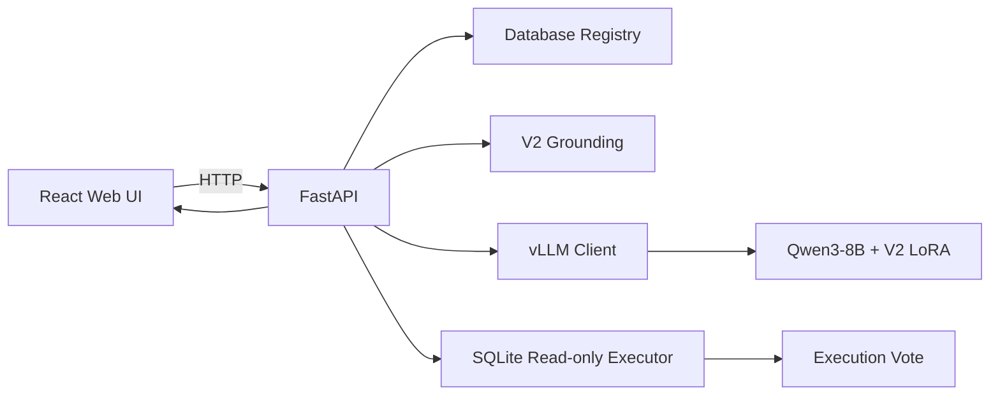

# VeriSQL Studio：V2 最终模型在线服务

`app/` 是 VeriSQL-RL 的唯一产品化部署入口。服务加载已冻结的 **V2 Exact-GRPO Adapter**，复用 V2 的数据库 Grounding、Prompt 构造、reasoning/SQL 解析、SQLite 只读执行和 pass@8 执行投票。

部署代码与 `pipelines/v1/`、`pipelines/v2/` 的训练代码分离，不修改训练权重、Reward、Checkpoint 选择或评测结果。

## 系统架构



运行链路：

```text
用户选择数据库并输入问题
→ Registry 读取 Schema 与数据库路径
→ V2 Grounding 检索相关列和值
→ 构造 V2 Prompt
→ vLLM 生成候选
→ 解析 reasoning 与 SQL
→ SQLite 只读执行
→ Fast 直接返回 / Accurate 执行投票
→ FastAPI 返回结构化结果
→ React 展示 Data、SQL、Grounding 与候选信息
```

## 界面


前端采用 React、TypeScript、Vite、Tailwind CSS、Motion 和 Lucide，包含：

- 80 个 BIRD Train/Dev 数据库的搜索与切换；
- 数据库 Schema 抽屉；
- 自然语言问题和可选 Evidence 输入；
- Fast / Accurate 模式切换；
- Grounding、生成、执行和投票状态；
- Data、SQL、Query Plan、Grounding、Candidates 结果视图；
- SQL 复制、结果表格和分阶段耗时展示。

## 在线模式

### Fast

```text
1 个 greedy 候选
→ SQL 解析
→ SQLite 只读执行
→ 返回查询结果
```

对应 BIRD Dev 单次生成指标：

```text
EX = 56.13
```

### Accurate

```text
1 个 greedy + 7 个 sampled 候选
→ 逐条执行 SQLite
→ 按 set(rows) 聚类
→ 执行结果投票
→ 返回选中 SQL 和查询结果
```

对应 BIRD Dev 系统指标：

```text
EX = 61.15
Executable Rate = 98.31%
```

`61.15` 是多候选执行投票后的系统指标，不属于单次模型生成指标。

## 运行资产

服务启动前需存在：

```text
model/Qwen3-8B/
pipelines/v2/runs/grpo/best_adapter/
data/interim/schema_catalog_train.json
data/interim/schema_catalog_dev.json
data/raw/databases/train/
data/raw/databases/dev/
pipelines/v2/artifacts/grounding/value_index.sqlite
```

线上服务不使用：

```text
model/Qwen3-14B-Instruct/
训练标注与 Gold SQL
Teacher rationale
GRPO rollout
Optimizer / Scheduler 状态
训练 Checkpoint
BIRD Evaluator
```

Teacher 只参与训练数据构造，线上推理只加载 Qwen3-8B 与最终 LoRA Adapter。

## 目录结构

```text
app/
├── README.md
├── requirements.txt
├── configs/
│   └── serve.yaml
├── backend/
│   ├── api.py                    # FastAPI 入口
│   ├── config.py                 # 部署配置加载
│   ├── database_registry.py      # 数据库白名单与 Schema
│   ├── model_client.py           # vLLM OpenAI-compatible Client
│   ├── query_service.py          # Fast / Accurate 编排
│   ├── response_parser.py        # reasoning 与 SQL 解析
│   ├── display_executor.py       # 展示结果与 Query Plan
│   ├── v2_bridge.py              # V2 Grounding / Prompt / Vote 适配
│   └── schemas.py                # 请求与响应模型
├── frontend/                     # React + Vite 前端
├── examples/
│   └── demo_queries.json
├── scripts/
│   ├── build_frontend.sh
│   ├── serve_model.sh
│   ├── serve_api.sh
│   └── run_app.sh
├── tests/
├── tools/
│   ├── smoke_test.py
│   └── benchmark_api.py
├── runtime/                      # 本地运行日志；Git 忽略
└── results/                      # 发布的性能基准与环境记录
```

## 部署环境

服务运行在 Linux CUDA 服务器上。Python 部署环境与训练环境分离：

```bash
cd /path/to/VeriSQL-RL
python -m venv .venv-deploy
source .venv-deploy/bin/activate
python -m pip install -U pip
pip install -r app/requirements.txt
```

`.venv-deploy/` 不进入 Git，可由 `app/requirements.txt` 重建。

## 前端环境

Node.js 版本要求：

```text
^20.19.0 或 >=22.12.0
```

安装并构建：

```bash
cd app/frontend
npm ci
npm run build
cd ../..
```

等价入口：

```bash
bash app/scripts/build_frontend.sh
```

生产构建输出到 `app/frontend/dist/`，由 FastAPI 静态托管。`node_modules/` 和 `dist/` 不进入 Git。

## 配置

配置文件：

```text
app/configs/serve.yaml
```

主要字段：

| 配置段 | 作用 |
|---|---|
| `app` | FastAPI 标题、监听地址、端口、最大并发和请求日志 |
| `model` | 基础模型、Adapter、Tokenizer、vLLM 地址与显存参数 |
| `paths` | Schema Catalog、数据库、Grounding index 和演示问题路径 |
| `grounding` | 召回列数与每列返回值数量 |
| `generation.fast` | Fast 模式生成参数 |
| `generation.accurate` | Accurate 模式采样参数 |
| `execution` | SQL 超时、投票最大行数、展示行数与最小投票支持数 |
| `frontend` | 前端开发服务器 Origin |

当前模型服务配置：

```text
vLLM：127.0.0.1:8001
Base model：model/Qwen3-8B
Adapter：pipelines/v2/runs/grpo/best_adapter
Served model name：verisql-v2
Max model length：8192
LoRA rank：32
Model GPU：0
```

Fast 模式：

```text
candidates = 1
temperature = 0.0
top_p = 1.0
max_new_tokens = 768
```

Accurate 模式：

```text
1 greedy + 7 sampled
temperature = 0.8
top_p = 0.95
seed = 42
max_new_tokens = 768
```

## 启动服务

### 一键启动

从仓库根目录执行：

```bash
source .venv-deploy/bin/activate
bash app/scripts/run_app.sh all
```

该命令依次完成：

1. 构建 React 前端；
2. 在 GPU 0 启动 vLLM；
3. 等待 `verisql-v2` 出现在 `/v1/models`；
4. 启动 FastAPI 并托管前端；
5. FastAPI 退出时清理由脚本启动的 vLLM 进程。

运行日志：

```text
app/runtime/vllm.log
app/runtime/requests.jsonl
```

### 分进程启动

终端一：

```bash
source .venv-deploy/bin/activate
bash app/scripts/serve_model.sh
```

终端二：

```bash
source .venv-deploy/bin/activate
bash app/scripts/serve_api.sh
```

### 开发模式

前端开发服务器：

```bash
bash app/scripts/run_app.sh dev-ui
```

FastAPI 热重载：

```bash
API_RELOAD=1 bash app/scripts/serve_api.sh
```

## 远程服务器访问

`serve_model.sh` 将 vLLM 绑定到 `127.0.0.1:8001`。FastAPI 的监听地址由 `app/configs/serve.yaml` 或环境变量 `API_HOST` 控制。

SSH Tunnel 模式下，在服务器启动：

```bash
API_HOST=127.0.0.1 bash app/scripts/run_app.sh all
```

在本地电脑新开终端：

```bash
ssh -N -L 8000:127.0.0.1:8000 <用户名>@<服务器地址>
```

保持 SSH 会话运行，在本地浏览器访问：

```text
http://127.0.0.1:8000
```

非默认 SSH 端口：

```bash
ssh -p <SSH端口> -N -L 8000:127.0.0.1:8000 \
  <用户名>@<服务器地址>
```

本地 8000 端口被占用时：

```bash
ssh -N -L 18000:127.0.0.1:8000 \
  <用户名>@<服务器地址>
```

浏览器访问：

```text
http://127.0.0.1:18000
```

vLLM 的 8001 端口只由服务器内部 FastAPI 调用，无需转发。

## HTTP API

### `GET /api/health`

```bash
curl --noproxy '*' http://127.0.0.1:8000/api/health
```

响应包含：

```text
status
api_ready
model_ready
adapter_name
grounding_ready
database_count
version
```

### `GET /api/databases`

```bash
curl --noproxy '*' http://127.0.0.1:8000/api/databases
```

返回 Registry 中的 Train/Dev 数据库列表、表数量和演示问题。

### `GET /api/databases/{db_id}`

```bash
curl --noproxy '*' \
  http://127.0.0.1:8000/api/databases/financial
```

返回指定数据库的：

```text
db_id
split
tables
foreign_keys
schema_text
```

### `POST /api/query`

Fast 查询：

```bash
curl --noproxy '*' -X POST http://127.0.0.1:8000/api/query \
  -H 'content-type: application/json' \
  -d '{
    "db_id": "financial",
    "question": "The average unemployment ratio of 1995 and 1996, which one has higher percentage?",
    "evidence": "A12 refers to unemployment rate 1995; A13 refers to unemployment rate 1996",
    "mode": "fast"
  }'
```

Accurate 查询：

```bash
curl --noproxy '*' -X POST http://127.0.0.1:8000/api/query \
  -H 'content-type: application/json' \
  -d '{
    "db_id": "financial",
    "question": "The average unemployment ratio of 1995 and 1996, which one has higher percentage?",
    "evidence": "A12 refers to unemployment rate 1995; A13 refers to unemployment rate 1996",
    "mode": "accurate"
  }'
```

请求字段：

| 字段 | 类型 | 说明 |
|---|---|---|
| `db_id` | string | Registry 中存在的数据库 ID |
| `question` | string | 自然语言问题 |
| `evidence` | string / null | 可选业务定义或计算规则 |
| `mode` | `fast` / `accurate` | 推理模式 |

响应字段：

| 字段 | 说明 |
|---|---|
| `request_id` | 请求 ID |
| `status` | 查询状态 |
| `db_id` / `split` / `mode` | 数据库和模式信息 |
| `grounding` | 检索到的列与真实值 |
| `candidates` | 所有生成候选及其执行状态 |
| `selected_candidate` | 最终选中的 reasoning、SQL 和候选信息 |
| `execution` | 展示结果、列名、行数、访问表列与错误信息 |
| `vote` | Accurate 模式的候选数、可执行数、支持数与选中原因 |
| `timings` | Grounding、Prompt、Generation、Execution、Vote 与总耗时 |

常见 HTTP 状态：

| 状态码 | 含义 |
|---:|---|
| 200 | 请求完成，业务执行状态位于响应 `status` |
| 400 | Prompt 超出模型上下文等无效请求 |
| 404 | `db_id` 未注册 |
| 422 | 请求字段不符合 Pydantic Schema |
| 503 | vLLM 模型服务不可用 |

## 执行安全

服务端执行边界：

- 只接受 Registry 中存在的 `db_id`；
- 不接受客户端文件路径；
- 不接受客户端直接提交 SQL；
- SQLite 连接为只读模式；
- Authorizer 拒绝写操作、危险函数和多语句；
- SQL 执行具有超时与最大行数限制；
- API 并发由 `max_concurrent_queries` 控制；
- vLLM 固定监听 loopback 地址。

该服务面向单机受控环境。公网部署仍需额外配置 HTTPS、认证、限流、审计和数据库权限隔离。

## Smoke Test

服务启动后执行：

```bash
python app/tools/smoke_test.py
```

Smoke Test 验证：

```text
/api/health
80 个数据库注册
数据库 Schema 接口
Fast 查询
Accurate 查询
Accurate 返回 8 个候选
最终 SQL 可执行
```

指定其他服务地址：

```bash
python app/tools/smoke_test.py \
  --base-url http://127.0.0.1:18000
```

## 在线性能基准

性能测试在单个 vLLM 实例上完成，模型服务运行于 GPU 0，FastAPI 的 `max_concurrent_queries` 固定为 `2`。每组测试使用同一批 8 个跨数据库示例，共发送 40 个请求，并分别测试并发 `1 / 2 / 4`。

测试环境：

| 项目 | 配置 |
|---|---|
| GPU | 1 × NVIDIA GeForce RTX 5090 32 GB |
| 基础模型 | Qwen3-8B BF16 |
| Adapter | VeriSQL-RL V2 Exact-GRPO LoRA |
| 最大上下文长度 | 8192 |
| Python | 3.11.15 |
| PyTorch | 2.13.0 + CUDA 13.0 |
| Transformers | 5.17.0 |
| vLLM | 0.29.0 |
| FastAPI | 0.136.3 |
| NVIDIA Driver | 590.48.01 |
| 单组请求数 | 40 |
| API 最大并发查询 | 2 |

### Fast 模式

| 并发 | 成功率 | QPS | P50 延迟 | P95 延迟 | P99 延迟 | 平均生成 | 平均 SQL 执行 | GPU 0 峰值显存 |
|---:|---:|---:|---:|---:|---:|---:|---:|---:|
| 1 | 100% | 0.844 | 1.306 s | 1.479 s | 1.486 s | 1.157 s | 13.61 ms | 28.56 GiB |
| 2 | 100% | 1.710 | 1.297 s | 1.459 s | 1.465 s | 1.146 s | 11.13 ms | 28.56 GiB |
| 4 | 100% | 1.709 | 2.344 s | 2.700 s | 2.715 s | 1.149 s | 11.63 ms | 28.56 GiB |

### Accurate 模式

| 并发 | 成功率 | QPS | P50 延迟 | P95 延迟 | P99 延迟 | 平均生成 | 平均 SQL 执行 | GPU 0 峰值显存 |
|---:|---:|---:|---:|---:|---:|---:|---:|---:|
| 1 | 100% | 0.641 | 1.681 s | 1.762 s | 2.117 s | 1.496 s | 48.07 ms | 28.56 GiB |
| 2 | 100% | 1.266 | 1.675 s | 1.820 s | 2.147 s | 1.530 s | 40.75 ms | 28.56 GiB |
| 4 | 100% | 1.271 | 3.251 s | 3.494 s | 3.495 s | 1.520 s | 41.21 ms | 28.56 GiB |

测试结果表明：

- 六组测试均完成 `40 / 40` 个请求，无 API 错误、OOM 或服务退出；
- 并发从 `1` 提升到 `2` 时，Fast 与 Accurate 的吞吐均接近翻倍，P50/P95 延迟基本保持稳定；
- 并发从 `2` 提升到 `4` 后，QPS 不再增长，而端到端延迟明显增加，符合 `max_concurrent_queries=2` 下的排队行为；
- Accurate 模式以更高的生成与 SQL 执行成本，换取 BIRD Dev EX 从 `56.13` 提升到 `61.15`；
- 模型服务仅使用 GPU 0，GPU 1 未参与在线推理；GPU 0 峰值显存占用为 `29,248 MiB`。
- 该结果为固定 8 道示例、单机单 GPU、40 请求/组的轻量在线基准，用于展示当前服务配置，不作为公网多租户 SLA。

原始性能结果与 GPU 采样记录位于：

```text
app/results/
├── benchmark_fast_c1.json
├── benchmark_fast_c2.json
├── benchmark_fast_c4.json
├── benchmark_accurate_c1.json
├── benchmark_accurate_c2.json
├── benchmark_accurate_c4.json
├── gpu_fast_c*.csv
├── gpu_accurate_c*.csv
├── environment_python.txt
└── environment_nvidia_smi.txt
```

### Benchmark 复现

Fast：

```bash
for concurrency in 1 2 4; do
  python app/tools/benchmark_api.py \
    --mode fast \
    --concurrency "$concurrency" \
    --requests 40
done
```

Accurate：

```bash
for concurrency in 1 2 4; do
  python app/tools/benchmark_api.py \
    --mode accurate \
    --concurrency "$concurrency" \
    --requests 40
done
```

Benchmark 工具输出：

```text
request_count
success_count
error_count
qps
latency_p50_ms
latency_p95_ms
latency_p99_ms
mean_generation_ms
mean_execution_ms
```

每次运行会更新：

```text
app/results/benchmark_<mode>_c<concurrency>.json
```

## 测试

后端单元测试不加载真实大模型：

```bash
pytest -q app/tests
```

前端生产构建：

```bash
bash app/scripts/build_frontend.sh
```

## 故障排查

### Adapter 不存在

检查：

```text
pipelines/v2/runs/grpo/best_adapter/
```

目录应包含：

```text
adapter_model.safetensors
adapter_config.json
tokenizer_config.json 或 tokenizer.json
Chat Template 相关文件
```

### `/v1/models` 中没有 `verisql-v2`

查看：

```bash
tail -f app/runtime/vllm.log
```

核对基础模型路径、Adapter 路径、LoRA rank、CUDA 显存和 vLLM 版本。

### 单卡 OOM

检查并调整：

```text
其他 GPU 进程
gpu_memory_utilization
max_model_len
API 并发
```

量化和双卡张量并行会改变部署形态，不属于默认服务配置。

### Grounding index 不存在

目标路径：

```text
pipelines/v2/artifacts/grounding/value_index.sqlite
```

该文件由 V2 `prepare` 阶段生成。

### SQLite 数据库不存在

目标路径：

```text
data/raw/databases/train/
data/raw/databases/dev/
```

### 本地浏览器无法访问

检查：

```text
FastAPI 是否在服务器 127.0.0.1:8000 运行
SSH Tunnel 会话是否保持连接
本地浏览器端口是否与 -L 左侧端口一致
服务器上的 API_HOST 是否为 127.0.0.1
```
