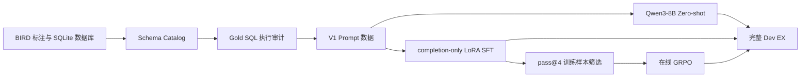

# VeriSQL-RL V1：SFT 与执行奖励 GRPO 基线流水线

V1 是 VeriSQL-RL 的可归因后训练基线。该流水线在统一的 BIRD 数据、Schema Prompt、生成配置和执行评测口径下，依次运行：

```text
Qwen3-8B Zero-shot
→ completion-only LoRA SFT
→ Execution-reward GRPO
```

V1 的核心作用是分离验证 SFT 和 GRPO 的独立增益，并记录二元执行奖励在在线训练中的信号稀疏问题。V1 推理采用 Qwen3 非思考模式和单次 greedy 生成；V1 GRPO 采用 pass@4 样本筛选、SQLite 0/1 执行奖励、组内相对 Advantage，以及 DAPO 风格的 completion-token 归一化。

## 最终结果

评测集为 BIRD-SQL Dev 2025-11-06，共 1,534 条样本。

| 模型 | Dev EX | 可执行率 | 格式遵循率 | Simple | Moderate | Challenging |
|---|---:|---:|---:|---:|---:|---:|
| Qwen3-8B Zero-shot | 44.07 | 83.90 | 94.52 | 56.05 | 34.09 | 18.61 |
| V1 SFT | 49.74 | 87.74 | 99.67 | 60.12 | 42.89 | 24.24 |
| V1 GRPO | **52.09** | **90.74** | **99.87** | **62.44** | **45.60** | **25.97** |

增量关系：

```text
Zero-shot 44.07
→ SFT 49.74：+5.67 pp
→ GRPO 52.09：+2.35 pp
```

内部 Validation 上，SFT EX 为 `63.10`，GRPO EX 为 `64.97`。

轻量结果：

- [V1 汇总](results/summary.json)
- [Zero-shot 指标](results/zero_shot/metrics.json)
- [SFT 指标](results/sft/metrics.json)
- [SFT 训练摘要](results/sft/training_summary.json)
- [GRPO 指标](results/grpo/metrics.json)
- [GRPO 训练摘要](results/grpo/training_summary.json)

## 流水线结构



## 技术实现

### completion-only LoRA SFT

每条训练样本通过 Qwen3 Chat Template 组织为：

```text
System + Schema + Evidence + Question + Gold SQL
```

训练标签满足：

```text
Prompt token  → label = -100
Padding token → label = -100
Gold SQL token → 保留原 token ID
```

因此语言模型损失只作用于 Assistant 的 Gold SQL。基础 Qwen3-8B 参数保持冻结，LoRA 注入以下线性层：

```text
q_proj, k_proj, v_proj, o_proj,
gate_proj, up_proj, down_proj
```

训练循环由项目自行实现，Accelerate 负责双卡 DDP、BF16、DataLoader 分片、梯度累积和跨卡指标聚合。

### Execution-reward GRPO

V1 GRPO 从 SFT 最优 Adapter 初始化：

1. 对 reward-eligible Train Prompt 生成 4 个候选；
2. 在对应 SQLite 数据库中执行候选 SQL；
3. 按 BIRD Execution Match 计算 0/1 奖励；
4. 保留候选组内同时出现正确与错误结果的问题；
5. 正式训练时由当前 Policy 在线重新采样；
6. 对组内奖励标准化并更新 LoRA Policy。

V1 的在线训练中约 `52.12%` 局部候选组没有奖励差异，即全对或全错。这一结果说明二元执行奖励能够继续提升 SFT 模型，但有效 Advantage 仍然稀疏。

## 前置资产

所有命令从仓库根目录运行：

```bash
cd /path/to/VeriSQL-RL
```

需要准备：

```text
model/Qwen3-8B/
data/raw/annotations/train/bird23_train_filtered.jsonl
data/raw/annotations/train/train_column_meaning.json
data/raw/annotations/dev/bird_sql_dev_20251106.json
data/raw/databases/train/
data/raw/databases/dev/
data/raw/official_release/train/train_tables.json
data/raw/official_release/dev/dev_tables.json
```

训练环境包含 CUDA-compatible PyTorch、Transformers、PEFT、Datasets、Accelerate 和 PyYAML。V1 正式训练使用两张 GPU。

## 配置

### SFT

配置文件：[configs/sft.yaml](configs/sft.yaml)

| 配置 | 数值 |
|---|---:|
| Base model | Qwen3-8B |
| Thinking | disabled |
| Precision | BF16 |
| Max length | 8192 |
| LoRA rank / alpha | 32 / 64 |
| LoRA dropout | 0.05 |
| 每卡 batch | 1 |
| 梯度累积 | 8 |
| 双卡全局 batch | 16 |
| Epoch | 2 |
| Learning rate | `5e-5` |
| Scheduler | cosine |

Token 审计结果显示，训练集最长完整序列为 6,471 tokens，`max_length=8192` 不会截断 Prompt 或 SQL 监督。完整统计位于 [results/data/sft_token_stats.json](results/data/sft_token_stats.json)。

### GRPO

配置文件：[configs/grpo.yaml](configs/grpo.yaml)

| 配置 | 数值 |
|---|---:|
| 初始化 Adapter | V1 SFT best_adapter |
| 候选数 | 4 |
| Temperature | 1.0 |
| Max new tokens | 512 |
| Reward | SQLite EX，0/1 |
| Reward timeout | 5 s |
| Epoch | 1 |
| Iteration / rollout | 1 |
| Loss normalization | DAPO-style completion token |
| Learning rate | `1e-6` |
| KL beta | 0 |
| Checkpoint interval | 50 optimizer steps |

## 统一入口

```text
pipelines/v1/scripts/run_pipeline.sh
```

阶段顺序：

```bash
bash pipelines/v1/scripts/run_pipeline.sh prepare
bash pipelines/v1/scripts/run_pipeline.sh zero-shot
bash pipelines/v1/scripts/run_pipeline.sh sft
bash pipelines/v1/scripts/run_pipeline.sh grpo
bash pipelines/v1/scripts/run_pipeline.sh dev
```

每个阶段独立运行并保存自身产物，支持在生成或训练中断后恢复。

## 阶段一：prepare

```bash
bash pipelines/v1/scripts/run_pipeline.sh prepare
```

该阶段依次执行：

```text
Schema Catalog 构建
→ Train/Dev Gold SQL 执行审计
→ V1 SFT/Validation/Dev 数据构造
→ Qwen3 Token 长度审计
```

公共产物：

```text
data/interim/schema_catalog_train.json
data/interim/schema_catalog_dev.json
data/interim/gold_sql_execution.jsonl
```

V1 数据产物：

```text
pipelines/v1/artifacts/data/sft_train.jsonl
pipelines/v1/artifacts/data/sft_val.jsonl
pipelines/v1/artifacts/data/dev_eval.jsonl
pipelines/v1/artifacts/data/sft_token_stats.json
```

固定数据规模：

| 划分 | 样本数 | 数据库数 |
|---|---:|---:|
| SFT Train | 6,013 | 62 |
| SFT Validation | 588 | 7 |
| Dev | 1,534 | 11 |

三个划分在数据库级别互不重叠。

## 阶段二：zero-shot

```bash
bash pipelines/v1/scripts/run_pipeline.sh zero-shot
```

使用未微调 Qwen3-8B 对完整 Dev 进行双卡样本并行 greedy 生成，并调用公共 BIRD Evaluator 计算 EX。

中断恢复：

```bash
bash pipelines/v1/scripts/run_pipeline.sh zero-shot --resume
```

产物：

```text
pipelines/v1/runs/zero_shot/
├── predictions.jsonl
├── scored_results.jsonl
└── metrics.json
```

## 阶段三：sft

```bash
bash pipelines/v1/scripts/run_pipeline.sh sft
```

执行流程：

```text
最长样本 Preflight
→ 20 optimizer-step Smoke Test
→ 双卡 LoRA 训练 2 epochs
→ 内部 Validation 选择 best_adapter
→ 完整 Dev greedy 生成与评测
```

从 epoch 边界 Checkpoint 恢复：

```bash
bash pipelines/v1/scripts/run_pipeline.sh sft \
  --resume-from pipelines/v1/runs/sft/model/checkpoints/step_NNNNNN
```

主要产物：

```text
pipelines/v1/runs/sft/
├── model/
│   ├── best_adapter/
│   ├── last_adapter/
│   └── checkpoints/
├── train_metrics.jsonl
├── eval_metrics.jsonl
├── summary.json
└── dev/
    ├── predictions.jsonl
    ├── scored_results.jsonl
    └── metrics.json
```

## 阶段四：grpo

```bash
bash pipelines/v1/scripts/run_pipeline.sh grpo
```

执行流程：

```text
加载 SFT best_adapter
→ pass@4 筛选可学习 Prompt
→ 当前 Policy 在线采样
→ SQLite 执行并计算 EX Reward
→ 组内 Advantage 标准化
→ LoRA Policy 更新
→ 内部 Validation
```

中断恢复：

```bash
bash pipelines/v1/scripts/run_pipeline.sh grpo --resume
```

主要产物：

```text
pipelines/v1/runs/grpo/
├── model/
│   ├── final_adapter/
│   ├── checkpoints/
│   └── .work/
├── train_metrics.jsonl
└── summary.json
```

## 阶段五：dev

```bash
bash pipelines/v1/scripts/run_pipeline.sh dev
```

使用 V1 最终 GRPO Adapter 对完整 Dev 运行单次 greedy 生成和 EX 评测。

中断恢复：

```bash
bash pipelines/v1/scripts/run_pipeline.sh dev --resume
```

产物：

```text
pipelines/v1/runs/grpo/dev/
├── predictions.jsonl
├── scored_results.jsonl
└── metrics.json
```

## 运行产物与发布结果

```text
pipelines/v1/artifacts/
```

保存由 `prepare` 阶段生成的训练数据和 Token 统计。

```text
pipelines/v1/runs/
```

保存完整本地实验产物，包括 Adapter、Checkpoint、逐样本预测、逐样本评分和训练日志。该目录不进入源码仓库。

```text
pipelines/v1/results/
```

保存适合提交到 Git 的轻量指标、训练摘要和曲线数据。

## V1 与 V2 的关系

V1 建立了完整的 Zero-shot → SFT → GRPO 对照，并定位了二元奖励下的 zero-signal group。V2 在不覆盖 V1 的前提下，增加数据库值 Grounding、Teacher Reasoning、混合困难样本筛选、Exact-only GRPO 和 pass@8 执行投票。

最终在线服务使用 V2 Exact-GRPO Adapter；V1 保留为可归因基线和实验对照。V2 说明位于 [../v2/README.md](../v2/README.md)。
