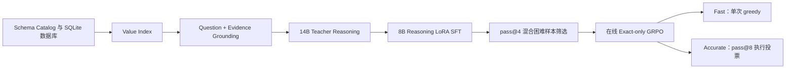

# VeriSQL-RL V2：Grounding、Reasoning SFT、Exact-GRPO 与执行投票

V2 是 VeriSQL-RL 的最终增强流水线。该版本针对 V1 暴露出的两个核心问题重新设计训练与推理链路：

1. 完整 Schema 仍不足以稳定完成字段和值匹配；
2. V1 二元执行奖励中约 `52.12%` 的在线局部候选组没有相对信号。

V2 的完整流程为：

```text
数据库值 Grounding
→ Qwen3-14B Teacher 生成简短推理
→ Qwen3-8B Grounded Reasoning LoRA SFT
→ 混合困难样本筛选
→ Exact-only GRPO
→ pass@8 Execution Vote
```

V2 复用根目录的 BIRD 标注、Schema Catalog、Gold SQL 执行审计和 SQLite 数据库；V2 专属源码、配置、训练资产、Adapter、运行记录和轻量结果均位于 `pipelines/v2/`。

## 最终结果

评测集为 BIRD-SQL Dev 2025-11-06，共 1,534 条样本。

| 模型或系统 | 推理口径 | 正确题数 | Dev EX | 可执行率 | 格式遵循率 |
|---|---|---:|---:|---:|---:|
| V2 SFT | 单次 greedy | 828 | 53.98 | 87.68 | 99.41 |
| V2 Exact-GRPO | 单次 greedy | 861 | **56.13** | 89.77 | 99.48 |
| V2 pass@8 Execution Vote | 多候选系统 | **938** | **61.15** | **98.31** | **99.67** |

增量关系：

```text
V2 SFT 53.98
→ Exact-GRPO 56.13：+33 题，+2.15 pp
→ pass@8 Vote 61.15：再 +77 题，+5.02 pp
```

执行投票相对 GRPO greedy：

- 99 道题由错误变为正确；
- 22 道题由正确变为错误；
- 净增加 77 道正确题。

分难度结果：

| 模式 | Simple | Moderate | Challenging |
|---|---:|---:|---:|
| V2 SFT greedy | 65.23 | 46.73 | 25.97 |
| V2 GRPO greedy | 66.63 | 50.79 | 27.27 |
| V2 Vote | **70.35** | **58.69** | **31.60** |

轻量结果：

- [V2 总览](results/summary.json)
- [Dev 汇总](results/dev/summary.json)
- [SFT Dev 指标](results/dev/sft_greedy_metrics.json)
- [GRPO greedy 指标](results/dev/greedy_metrics.json)
- [Vote 指标](results/dev/vote_metrics.json)
- [SFT 训练与选择](results/sft/summary.json)
- [Screen 统计](results/screen/summary.json)
- [GRPO 训练与选择](results/grpo/summary.json)

## 流水线结构



## 核心设计

### 1. 数据库值 Grounding

V2 在完整 Schema 之外，从数据库真实值中检索与 `question + evidence` 相关的列和值：

```text
Question + Evidence
→ 相关列召回
→ 每列少量真实值
→ Grounding 文本
→ V2 Prompt
```

Grounding 不读取 Gold SQL，因此训练、验证、Dev 和在线部署共用同一检索逻辑。

已构建的索引覆盖：

| 统计项 | 数量 |
|---|---:|
| 数据库 | 80 |
| 数据列 | 4,337 |
| 可检索值列 | 2,321 |
| 扫描值 | 3,549,507 |
| 索引唯一值 | 406,616 |

Grounding 覆盖率：Train `6012 / 6013`，Validation `588 / 588`，Dev `1534 / 1534`。

### 2. Teacher Reasoning SFT

Teacher 模型只生成简短、结构化的查询推理。最终监督 SQL 始终逐字来自官方 Annotation Gold SQL，Teacher 不改写 SQL。

学生训练目标由以下部分构成：

```text
System + Schema + Grounding + Evidence + Question
→ Reasoning
→ Gold SQL
```

线上服务只加载 Qwen3-8B 与最终 LoRA Adapter，不加载 Teacher。

### 3. 混合困难样本筛选

Screen 阶段对 reward-eligible Train Prompt 生成 4 个候选，并选择两类问题：

- **Exact mixed**：候选中同时存在 EX=1 和 EX=0；
- **Partial mixed**：候选全部错误，但表、列、返回形状或结果集合等部分执行特征存在差异。

部分分数只用于筛选训练问题，不进入正式 GRPO 策略梯度。

Screen 结果：

| 统计项 | 数量 |
|---|---:|
| Reward-eligible Prompt | 5,939 |
| 可评分 Prompt | 5,937 |
| 生成候选 | 23,756 |
| 选中 Prompt | 2,628 |
| 选择率 | 44.25% |
| Exact mixed | 1,880 |
| Zero-exact partial-variance | 748 |

### 4. Exact-only GRPO

正式 GRPO 为每个 Prompt 在线生成 8 个候选，奖励严格采用 BIRD 执行正确性：

```text
候选结果集合与 Gold 结果集合相同 → reward = 1
其他结果 → reward = 0
```

只有组内同时出现正确与错误候选时才产生有效 Advantage。达到生成长度上限的候选不参与 Advantage 和 Loss。

训练共处理 2,628 个 Prompt，形成 1,135 个 optimizer steps。选中的 Checkpoint 为 `step_000800`。

### 5. pass@8 Execution Vote

Accurate 模式生成：

```text
1 个 greedy 候选 + 7 个 sampled 候选
```

候选分别执行 SQLite，然后按 `set(rows)` 聚类：

- 非空成功结果存在时，空结果簇不参与多数票；
- 唯一最大结果簇达到最小支持数时覆盖 greedy；
- 并列时优先 greedy 所在簇；
- 其余并列按平均 completion log-prob 决定；
- 候选选择过程不读取 Gold SQL。

因此 `61.15` 是完整系统指标，`56.13` 是单次模型指标。

## 前置资产

所有命令从仓库根目录运行：

```bash
cd /path/to/VeriSQL-RL
```

需要准备：

```text
model/Qwen3-8B/
model/Qwen3-14B-Instruct/                  # 仅 Teacher 阶段
data/raw/annotations/train/bird23_train_filtered.jsonl
data/raw/annotations/dev/bird_sql_dev_20251106.json
data/raw/databases/train/
data/raw/databases/dev/
data/interim/schema_catalog_train.json
data/interim/schema_catalog_dev.json
data/interim/gold_sql_execution.jsonl
```

公共 Schema Catalog 和 Gold SQL 执行审计由 V1 `prepare` 阶段生成：

```bash
bash pipelines/v1/scripts/run_pipeline.sh prepare
```

训练环境包含 CUDA-compatible PyTorch、Transformers、PEFT、Accelerate 和 PyYAML。V2 SFT 与 GRPO 使用两张 GPU。

## 配置

配置文件：[configs/pipeline.yaml](configs/pipeline.yaml)

### Grounding

| 配置 | 数值 |
|---|---:|
| 每列扫描行数 | 5000 |
| 每列最大唯一值 | 500 |
| 单值最大字符数 | 128 |
| Top columns | 8 |
| Values per column | 3 |

### Teacher

| 配置 | 数值 |
|---|---:|
| Teacher | Qwen3-14B-Instruct |
| Max new tokens | 256 |
| Max length | 8192 |
| Device map | balanced |

### SFT

| 配置 | 数值 |
|---|---:|
| Max length | 8192 |
| Thinking | enabled |
| LoRA rank / alpha | 32 / 64 |
| LoRA dropout | 0.05 |
| 每卡 batch | 1 |
| 梯度累积 | 8 |
| 双卡全局 batch | 16 |
| Epoch | 2 |
| Learning rate | `5e-5` |

SFT 第 2 个 epoch 被选为最终 Adapter，内部 Validation EX 为 `70.41`，可执行率为 `95.24`。

### GRPO

| 配置 | 数值 |
|---|---:|
| 候选数 | 8 |
| Temperature | 0.8 |
| Top-p | 0.95 |
| Max new tokens | 768 |
| Reward | BIRD EX，0/1 |
| Learning rate | `1e-6` |
| Checkpoint interval | 200 optimizer steps |
| Smoke optimizer steps | 4 |

选中 `step_000800`：内部 Validation greedy EX `70.92`，pass@8 Vote EX `76.02`。

环境变量覆盖：

```bash
export PYTHON_BIN=/path/to/python
export ACCELERATE_BIN=/path/to/accelerate
export V2_CONFIG=/path/to/pipeline.yaml
export CUDA_VISIBLE_DEVICES=0,1
```

## 统一入口

```text
pipelines/v2/scripts/run_pipeline.sh
```

阶段顺序：

```bash
bash pipelines/v2/scripts/run_pipeline.sh prepare
bash pipelines/v2/scripts/run_pipeline.sh teacher
bash pipelines/v2/scripts/run_pipeline.sh sft
bash pipelines/v2/scripts/run_pipeline.sh screen
bash pipelines/v2/scripts/run_pipeline.sh grpo
bash pipelines/v2/scripts/run_pipeline.sh dev
```

## 阶段一：prepare

```bash
bash pipelines/v2/scripts/run_pipeline.sh prepare
```

执行流程：

```text
扫描 Train/Dev SQLite 文本值
→ 构建 value_index.sqlite
→ 检索 Train/Validation/Dev Grounding
→ 构造 V2 基础样本
→ 构造 GRPO Reward Manifest
```

主要产物：

```text
pipelines/v2/artifacts/grounding/value_index.sqlite
pipelines/v2/artifacts/data/grounding_audit.json
pipelines/v2/artifacts/data/train.jsonl
pipelines/v2/artifacts/data/validation.jsonl
pipelines/v2/artifacts/data/dev.jsonl
pipelines/v2/artifacts/data/train_reward_manifest.jsonl
```

固定规模：Train 6,013，Validation 588，Dev 1,534；三个划分在数据库级别互不重叠。

## 阶段二：teacher

```bash
bash pipelines/v2/scripts/run_pipeline.sh teacher
```

执行流程：

```text
最长输入 Smoke Test
→ 生成完整 Train rationale
→ 生成完整 Validation rationale
→ 构建 reasoning SFT 数据
```

主要产物：

```text
pipelines/v2/artifacts/teacher/rationales.train.jsonl
pipelines/v2/artifacts/teacher/rationales.validation.jsonl
pipelines/v2/artifacts/data/sft_train.jsonl
pipelines/v2/artifacts/data/sft_validation.jsonl
```

中断恢复：

```bash
bash pipelines/v2/scripts/run_pipeline.sh teacher --resume
```

## 阶段三：sft

```bash
bash pipelines/v2/scripts/run_pipeline.sh sft
```

执行流程：

```text
最长样本 Preflight
→ 20 optimizer-step Smoke Test
→ 双卡 2-epoch LoRA SFT
→ 每个 epoch 完整 Validation greedy 评测
→ 选择 best_adapter
```

主要产物：

```text
pipelines/v2/runs/sft/
├── checkpoints/epoch_001/
├── checkpoints/epoch_002/
├── best_adapter/
├── selection.json
└── summary.json
```

从完整 epoch Checkpoint 恢复：

```bash
bash pipelines/v2/scripts/run_pipeline.sh sft \
  --resume-from pipelines/v2/runs/sft/checkpoints/epoch_001
```

## 阶段四：screen

```bash
bash pipelines/v2/scripts/run_pipeline.sh screen
```

该阶段使用选中的 SFT Adapter 生成 4 个候选，并根据 Exact mixed / Partial mixed 规则选择 GRPO Prompt。

中断恢复：

```bash
bash pipelines/v2/scripts/run_pipeline.sh screen --resume
```

主要产物：

```text
pipelines/v2/runs/screen/selected_prompts.jsonl
pipelines/v2/runs/screen/summary.json
```

## 阶段五：grpo

```bash
bash pipelines/v2/scripts/run_pipeline.sh grpo
```

执行流程：

```text
4 optimizer-step Smoke Test
→ 从 SFT best_adapter 启动在线 Exact-only GRPO
→ 每 200 optimizer steps 保存 Checkpoint
→ 每个 Checkpoint 运行完整 Validation greedy + pass@8 Vote
→ 依据 Vote、可执行率和 greedy 指标选择 best_adapter
```

中断恢复：

```bash
bash pipelines/v2/scripts/run_pipeline.sh grpo --resume
```

主要产物：

```text
pipelines/v2/runs/grpo/
├── checkpoints/step_*/
├── final_checkpoint/
├── best_adapter/
├── train_metrics.jsonl
├── selection.json
└── summary.json
```

## 阶段六：dev

```bash
bash pipelines/v2/scripts/run_pipeline.sh dev
```

该阶段在完整 1,534 条 Dev 上生成三组结果：

1. `sft_greedy`：V2 SFT best_adapter 单次 greedy；
2. `greedy`：V2 Exact-GRPO best_adapter 单次 greedy；
3. `vote`：V2 Exact-GRPO 的 `1 greedy + 7 sampled` 执行投票。

中断恢复：

```bash
bash pipelines/v2/scripts/run_pipeline.sh dev --resume
```

主要产物：

```text
pipelines/v2/runs/dev/
├── sft_greedy/
│   ├── predictions.jsonl
│   ├── scored_results.jsonl
│   └── metrics.json
├── greedy/
│   ├── predictions.jsonl
│   ├── scored_results.jsonl
│   └── metrics.json
├── vote/
│   ├── predictions.jsonl
│   ├── scored_results.jsonl
│   └── metrics.json
└── summary.json

pipelines/v2/runs/summary.json
```

## 运行产物与发布结果

```text
pipelines/v2/artifacts/
```

保存 Grounding index、Teacher rationale、V2 训练数据和 Reward Manifest。

```text
pipelines/v2/runs/
```

保存 Adapter、Checkpoint、逐题候选、逐题评分、日志与完整本地结果。该目录不进入源码仓库。

```text
pipelines/v2/results/
```

保存可提交到 Git 的轻量指标、训练摘要、Checkpoint 选择和 Dev 汇总。

## 与 VeriSQL Studio 的关系

最终在线服务加载：

```text
model/Qwen3-8B
+
pipelines/v2/runs/grpo/best_adapter
```

部署复用 V2 的 Schema 渲染、Grounding 检索、reasoning/SQL 解析、SQLite 只读执行和 pass@8 投票。线上服务不读取 Teacher、训练 Gold SQL、训练 Checkpoint 或 BIRD Evaluator。

部署说明位于 [../../app/README.md](../../app/README.md)。

## 结果解释边界

- V2 SFT 的 `53.98` 表示 Grounding + Teacher Reasoning SFT 的整体单次生成效果；
- Exact-only GRPO 在相同 V2 输入下将单次 greedy 提升至 `56.13`；
- pass@8 Vote 将系统 EX 提升至 `61.15`；
- `61.15` 不能与其他模型的单次 greedy 指标作完全同口径比较；
- Dev 只用于最终评测，不参与 SFT/GRPO 参数更新或 Checkpoint 选择。
